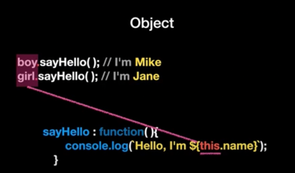
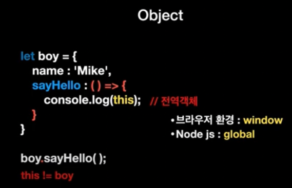

## Javascript

> 자료 : [코딩앙마] 왕 초보 자바스크립트
> ca_chapterX.js

### 1. 변수
* alert() : 경고창을 찍는 함수
* console.log() : 로그를 찍는 함수

* let : 최초로 선언하는 모든 변수에 붙여 중복을 방지, 변할 수 있음 
* const : 절대로 바뀌지 않는 상수

### 2. 자료형
* 문자형 : ' ', " ", ` `
* 숫자형 : 사칙연산 가능 (0으로 나누면 무한대, 문자를 숫자로 나누면 NaN)
* bool형 : true, false
* null -> 존재하지 않는 값
* undefined -> 할당되지 않은 값
* 객체형
* 심볼형
* typeof 연산자 : 변수의 자료형 확인

* 숫자형 + 문자형 => 숫자형이 문자형으로 변환

### 3. alert, prompt, confirm
**alert**
* 알려줌
* 메세지를 띄우고 확인 용도

**prompt**
* 입력 받음
* prompt("message", "default")
* 문자형으로 

**confirm**
* 확인 받음
* 확인, 취소(null 할당) 버튼이 있음
* 사용자 액션 확인시 자주 사용

=> 
장점:
    빠르고 간단함
단점:
    1. 스크립트 일시 정지
    2. 스타일링 X

 
### 4. 형변환 (명시적)
* 자동 형변환

**String()**
* 문자형으로 변환

**Number()**
* 숫자형으로 변환
* 문자가 들어있으면 NaN

**Boolean()**
* 불린형으로 변환
* 0, 빈 문자열, null, undefined, NaN => false

*!주의*

     Number(null) => 0
     Number(undefined) => NaN

### 5. 기본 연산자
* +, -, *, /
* // - 나머지
* ** - 거듭제곱
* ++, -- - 증가연산자, 감소연산자

### 6. 비교 연산자, 조건문 (if, else)
* 비교 연산자 - <, >, <= , >=, ==(동등 연산자), !=
* === : 일치 연산자, 타입까지 비교 ( 1 == '1' -> true 로 출력됨)
* 조건문 - if, else, else if
```
if(조건){
    조건이 참일 때 실행될 부분
} else if (조건1) {
    조건1이 참일 때 실행될 부분
} else {
    조건을 모두 만족하지 못할 때 실행될 부분
}
```

### 7. 논리 연산자 (AND, OR, NOT)
* || - OR
* && - AND
* ! - NOT
=> 평가 시 성능 최적화(필터링)할 때 활용될 수 있음.
* 우선 순위 : AND > OR

### 8. 반복문 (for, while, do while)
1. for문
```
for (초기값; 조건; 코드 실행 후 작업) {
    반복할 코드
}
```
2. while문
```
while (조건) {
    조건이 참일 동안 반복할 코드
}
```
3. do while문
```
do {
    무조건 한 번 실행 후, 조건이 참일 동안 반복
} while (조건)
```
4. break : 멈추고 빠져나옴
5. continue : 멈추고 다음 반복으로 진행

### 9. switch문
* case가 다양할 경우 사용
```
switch (평가) {
    case A:
        A일 때 코드
        break;
    case B:
        B일 때 코드
        break;
    default:
        case에 만족하는 게 없을 때 실행할 코드
}
```

### 10. 함수(function)의 기초
```
function 함수명(매개변수){
    함수 실행 코드
}
```
* 중복을 줄여줌
* 지역 변수를 외부에서도 사용하고 싶으면 밖으로 빼줘야 함
* let은 같은 이름의 변수에 대해 한 번만 지정해야 하지만, 전역 변수와 지역 변수는 독립적으로 사용될 수 있음.
* return을 함수 종료 목적으로 사용하기도 함.

### 11. 함수 표현식, 화살표 함수(arrow function)
* 함수 선언문 -> 기존의 함수, 어디서든 호출 가능 (호이스팅)
* 함수 표현식 -> 함수 이름을 짓지 않고 변수에 할당, 코드에 도달하면 생성
* 화살표 함수 -> `=>`를 사용해 함수를 간단히 정의, 함수 안의 return문은 소괄호로 변환 가능, 한줄일 경우는 이것도 생략 가능

### 12. 객체(Object)
```
객체명 = {
    key : value,
    key : value,
    ...
}
```
* 접근 - `객체명.key`, `객체명['key']`
* 추가 - `객체명.key = value;`, `객체명['key'] = value;`
* 삭제 - `delete 객체명.key`
* 존재 여부 확인 - 존재하지 않는 property의 경우 undefined
* for ... in 반복문
```
for (let key in 객체명) {
    console.log(key)
    console.log(객체명[key])
}
```

### 13. 객체(Object) - method, this
* method : 객체 프로퍼티로 할당 된 함수
* this => 객체를 가리킴
    * 화살표 함수는 일반 함수와 달리 자신만의 this를 가지지 않아 함수 내부에서 this를 사용하면, 외부에서 값을 가져옴.



### 14. 배열(Array)
: 순서가 있는 리스트 `[]`
* 문자, 숫자, 객체, 함수 등 포함 가능
* `.length` - 배열의 길이 반환
* `.push()` - 배열 끝에 추가
* `.pop()` - 배열 끝에 요소 제거
* `.unshift()` - 배열 앞에 추가
* `.shift()` - 배열 앞에 요소 제거
* for문 / for ... of문